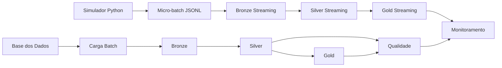

# Pipeline Híbrido para Análise da Alfabetização no Brasil

Projeto desenvolvido para o Tech Challenge – Fase 2.

## Status atual

Implementado e validado no Google Cloud / BigQuery:

- Ingestão batch das seis fontes obrigatórias;
- Arquitetura Medalhão: Bronze, Silver e Gold;
- Validações de qualidade e integridade;
- Gold municipal, estadual, nacional e temporal;
- Simulação de streaming por micro-batches;
- Monitoramento operacional básico;
- Controles de FinOps com particionamento, clustering e seleção explícita de colunas.

## Contexto

O projeto utiliza dados do Indicador Criança Alfabetizada disponíveis na Base dos Dados. A pipeline integra dados nacionais, estaduais, municipais e microdados de alunos para apoiar análises de desempenho, acompanhamento de metas e futuras aplicações de inteligência artificial.

## Arquitetura



## Camadas

### Bronze

Preserva os dados originais e adiciona metadados técnicos:

- data de partição;
- data de ingestão;
- origem da fonte.

### Silver

Aplica:

- padronização de tipos;
- tratamento de chaves;
- tradução de códigos documentados;
- validação estrutural;
- identificação de registros aptos para análise.

### Gold

Tabelas analíticas:

- `gold.indicador_municipio`;
- `gold.indicador_uf`;
- `gold.indicador_brasil`;
- `gold.evolucao_alfabetizacao`;
- `gold.indicador_streaming`.

## Resultados validados

### Batch

- 3.902.927 registros preservados entre Bronze e Silver;
- 0 diferenças de volume;
- 0 chaves duplicadas nas tabelas Gold;
- 59 regras de qualidade analisadas;
- nenhuma regra crítica em revisão.

### Streaming simulado

- 5 eventos simulados;
- 5 municípios distintos;
- 0 eventos inválidos;
- 0 eventos identificados como reais;
- fluxo Bronze → Silver → Gold concluído.

## Estrutura do repositório

```text
pipeline-alfabetizacao/
├── README.md
├── requirements.txt
├── .gitignore
├── sql/
│   ├── bronze/
│   ├── silver/
│   ├── gold/
│   ├── quality/
│   ├── monitoring/
│   └── streaming/
├── src/
│   └── streaming/
├── docs/
└── evidencias/
```

## Tecnologias

- Google Cloud;
- BigQuery;
- Cloud Shell;
- SQL;
- Python;
- Git e GitHub.

## Streaming

Por limitação do BigQuery Sandbox, foi implementada uma simulação em tempo quase real por micro-batches. Um script Python gera eventos JSONL identificados explicitamente como simulados, e o Cloud Shell executa a carga incremental no BigQuery.

Em uma arquitetura de produção, essa etapa poderia ser substituída por Pub/Sub e processamento contínuo.

## Qualidade

As regras incluem:

- igualdade de volume entre Bronze e Silver;
- chaves obrigatórias;
- duplicidades;
- taxas entre 0 e 100;
- registros estruturalmente inválidos;
- integridade entre metas e resultados;
- classificação de todas as comparações válidas.

## FinOps

Decisões aplicadas:

- uso do BigQuery Sandbox;
- seleção explícita de colunas;
- particionamento pela data atual de ingestão;
- clustering por chaves frequentemente consultadas;
- tabelas pequenas sem particionamento desnecessário;
- remoção de tabelas temporárias;
- monitoramento de bytes processados.

## Aplicações futuras em IA

A camada Gold pode apoiar:

- previsão de taxas de alfabetização;
- identificação de municípios em risco;
- classificação de vulnerabilidade educacional;
- análise de desigualdades;
- priorização de políticas públicas;
- criação de clusters de municípios.

## Limitações

- o streaming foi simulado por micro-batches;
- não foram integradas fontes externas opcionais;
- divergências entre tabelas de metas e resultados foram preservadas;
- valores ausentes da fonte não foram convertidos em zero;
- o significado de `nivel_alfabetizacao` não foi inferido sem documentação oficial.

## Execução

1. Execute os scripts da pasta `sql/bronze`.
2. Execute os scripts da pasta `sql/silver`.
3. Execute os scripts da pasta `sql/gold`.
4. Execute os scripts de `sql/quality`.
5. Execute o simulador em `src/streaming`.
6. Execute os scripts de `sql/streaming`.
7. Execute `sql/monitoring/monitoramento_pipeline.sql`.

## Evidências

As capturas de tela e CSVs de validação devem ser organizados na pasta `evidencias/`.
