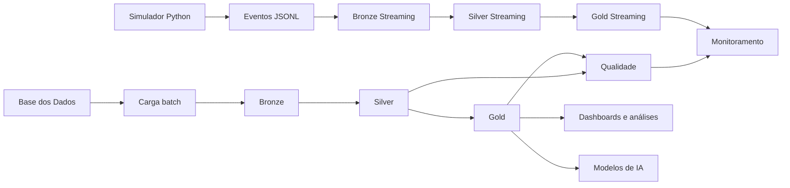
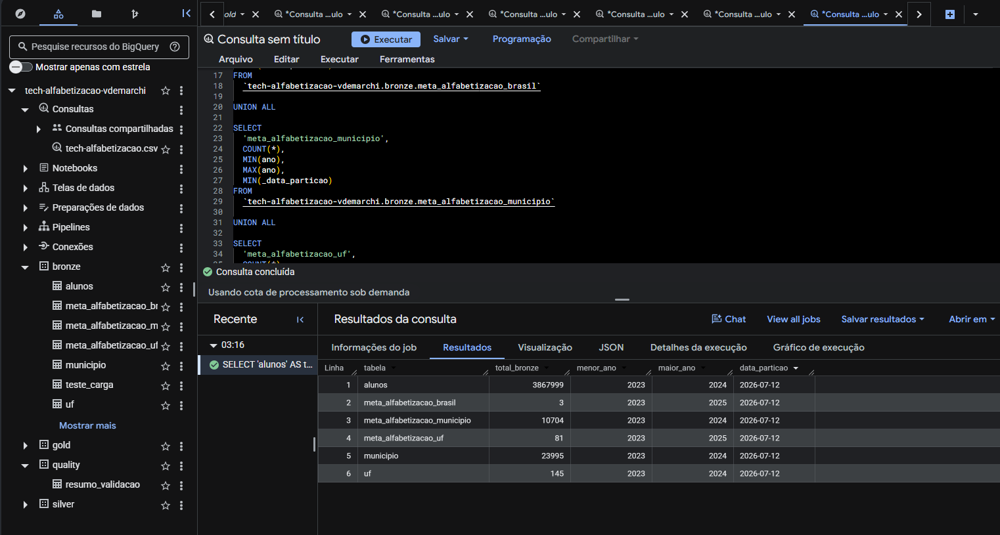
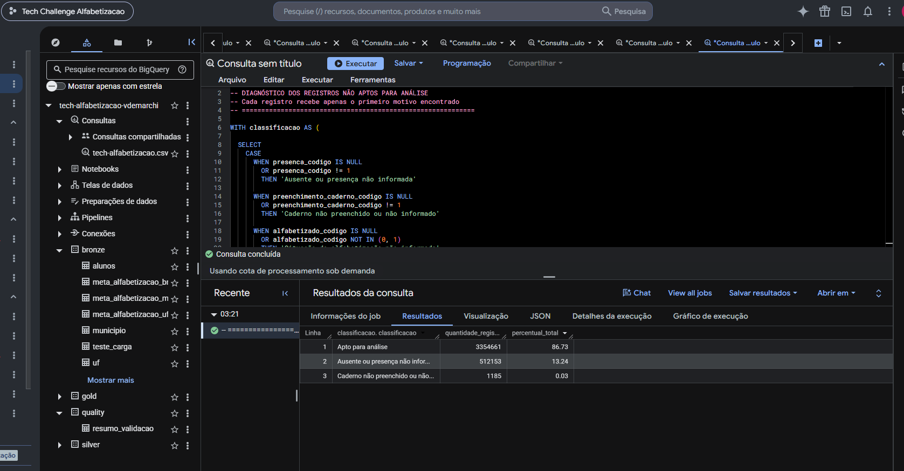
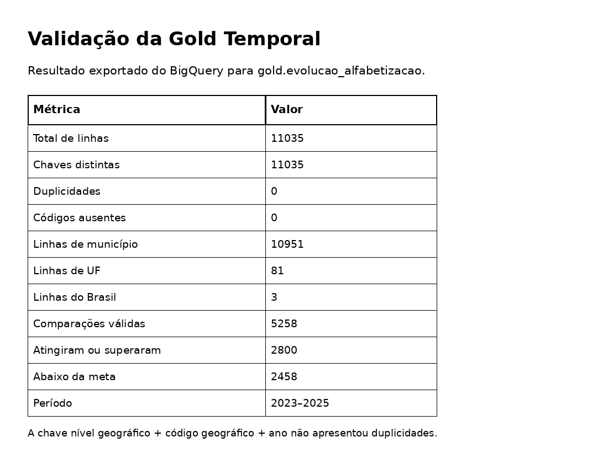
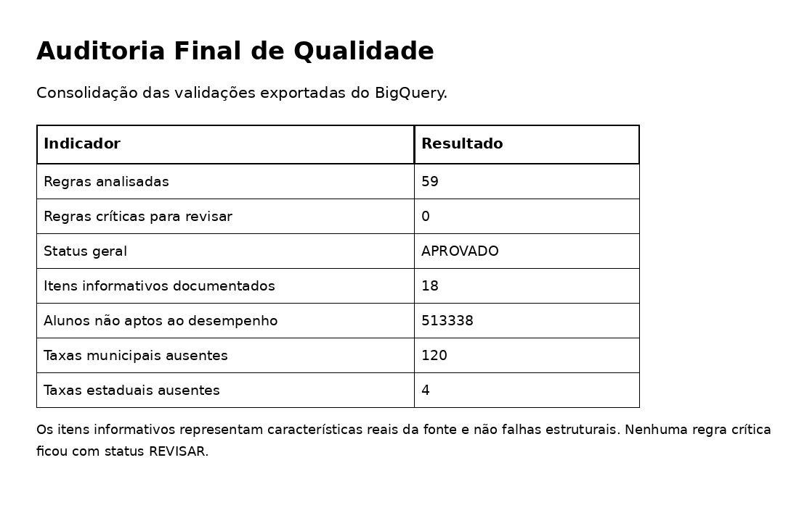
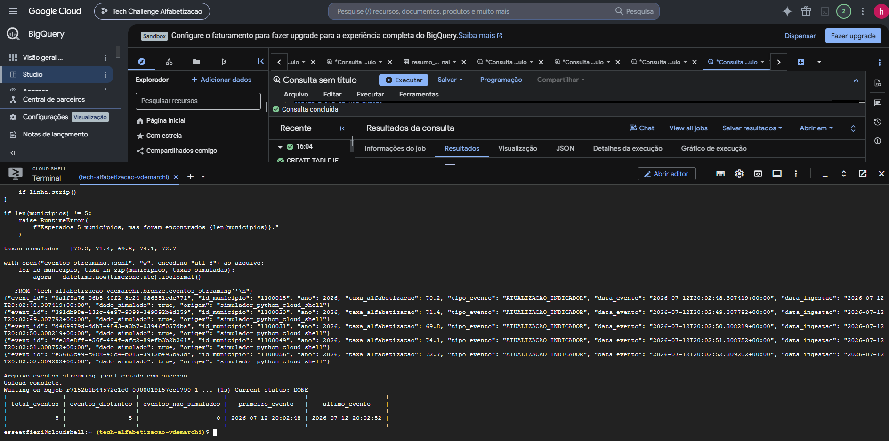
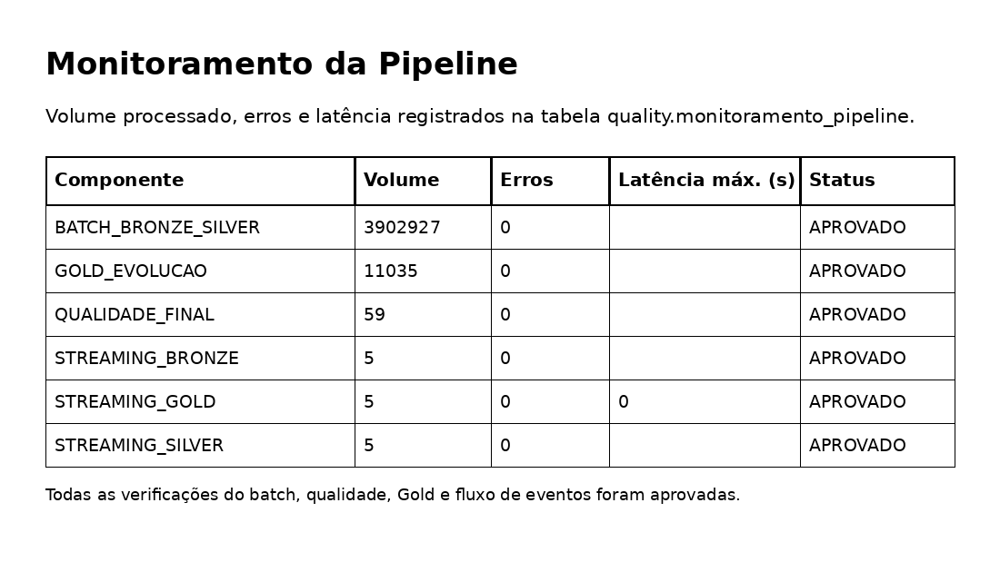

# Pipeline Híbrido para Análise da Alfabetização no Brasil

Projeto desenvolvido para o **Tech Challenge – Fase 2**.

## 1. Visão geral

Este projeto implementa uma pipeline de dados no Google Cloud para integrar, tratar e analisar informações do **Indicador Criança Alfabetizada** disponibilizadas pela Base dos Dados.

A solução combina:

- processamento **batch** para os dados históricos;
- arquitetura **Medalhão** com camadas Bronze, Silver e Gold;
- validações de qualidade e integridade;
- simulação de ingestão em tempo quase real por **micro-batches**;
- monitoramento de volume, erros e latência;
- práticas de FinOps no BigQuery.

## 2. Problema de negócio

Os dados de alfabetização estão distribuídos em diferentes níveis de granularidade:

- Brasil;
- unidades federativas;
- municípios;
- microdados de alunos.

O objetivo foi criar uma base única, rastreável e confiável para:

- acompanhar resultados de alfabetização;
- comparar resultados com metas;
- identificar diferenças entre fontes;
- apoiar dashboards e análises estatísticas;
- preparar os dados para futuras aplicações de inteligência artificial.

## 3. Arquitetura



## 4. Estrutura do repositório

```text
pipeline-alfabetizacao/
├── README.md
├── requirements.txt
├── .gitignore
├── docs/
│   ├── arquitetura.md
│   ├── checklist_entrega.md
│   ├── decisoes_arquiteturais_e_custos.md
│   ├── plano_git.md
│   └── roteiro_video.md
├── evidencias/
├── sql/
│   ├── bronze/
│   ├── silver/
│   ├── gold/
│   ├── quality/
│   ├── monitoring/
│   └── streaming/
└── src/
    └── streaming/
        ├── gerar_eventos.py
        ├── executar_microbatch.sh
        └── README.md
```

## 5. Fontes de dados

Foram utilizadas as seis tabelas obrigatórias da Base dos Dados:

- `alunos`;
- `meta_alfabetizacao_brasil`;
- `meta_alfabetizacao_municipio`;
- `meta_alfabetizacao_uf`;
- `municipio`;
- `uf`.

## 6. Camada Bronze

A Bronze preserva os dados de origem e adiciona metadados técnicos:

- `_data_particao`;
- `_data_ingestao`;
- `_fonte`.

### Volumes validados

| Tabela | Registros |
|---|---:|
| alunos | 3.867.999 |
| meta_alfabetizacao_brasil | 3 |
| meta_alfabetizacao_municipio | 10.704 |
| meta_alfabetizacao_uf | 81 |
| municipio | 23.995 |
| uf | 145 |

Total batch preservado: **3.902.927 registros**.

## 7. Camada Silver

Na Silver foram aplicadas:

- padronização de tipos;
- tratamento de chaves;
- tradução de códigos documentados;
- validação estrutural;
- identificação de registros aptos para análise;
- preservação de valores ausentes da fonte como `NULL`.

### Microdados de alunos

- registros totais: **3.867.999**;
- registros aptos para análise: **3.354.661**;
- ausente ou presença não informada: **512.153**;
- caderno não preenchido ou não informado: **1.185**.

## 8. Camada Gold

Foram criadas as seguintes tabelas analíticas:

- `gold.indicador_municipio`;
- `gold.indicador_uf`;
- `gold.indicador_brasil`;
- `gold.evolucao_alfabetizacao`;
- `gold.indicador_streaming`.

### Gold municipal

- 10.951 linhas;
- 0 duplicidades;
- 5.232 comparações válidas com a meta do próprio ano;
- 2.788 municípios atingiram ou superaram a meta;
- 2.444 ficaram abaixo da meta.

### Gold estadual

- 81 linhas;
- 0 duplicidades;
- 24 comparações válidas;
- 11 resultados atingiram ou superaram a meta;
- 13 ficaram abaixo da meta.

### Gold nacional

- 3 linhas;
- 0 duplicidades;
- 2 comparações válidas;
- 1 resultado atingiu ou superou a meta;
- 1 ficou abaixo da meta;
- 1 ano não possuía meta de referência.

### Gold temporal consolidada

- 11.035 linhas;
- 11.035 chaves distintas;
- 0 duplicidades;
- 0 códigos geográficos ausentes;
- 10.951 linhas municipais;
- 81 linhas estaduais;
- 3 linhas nacionais;
- período de 2023 a 2025.

## 9. Qualidade dos dados

As regras de qualidade verificam:

- igualdade de volume entre Bronze e Silver;
- chaves obrigatórias;
- duplicidades;
- taxas fora do intervalo de 0 a 100;
- registros estruturalmente inválidos;
- integridade entre metas e resultados;
- classificação de todas as comparações válidas.

Resultado final:

- **59 regras analisadas**;
- **0 regras críticas com status `REVISAR`**;
- divergências e ausências reais da fonte registradas como informativas.

As diferenças entre tabelas de metas e resultados foram preservadas para garantir rastreabilidade.

## 10. Streaming simulado

Por limitação do BigQuery Sandbox, foi implementada uma simulação em tempo quase real por micro-batches.

Fluxo:

```text
Python
  ↓
arquivo JSONL
  ↓
Bronze de eventos
  ↓
Silver de eventos
  ↓
Gold de eventos
```

Cada evento contém:

- identificador único;
- município;
- ano;
- taxa simulada;
- data do evento;
- data de ingestão;
- origem;
- marcação explícita `dado_simulado = true`.

Resultados:

- 5 eventos processados;
- 5 IDs distintos;
- 5 municípios distintos;
- 0 eventos inválidos;
- 0 eventos identificados como reais.

Em uma arquitetura de produção, essa etapa poderia ser substituída por Pub/Sub e processamento contínuo.

## 11. Monitoramento

A tabela `quality.monitoramento_pipeline` registra:

- volume processado;
- registros com erro;
- latência média;
- latência máxima;
- status de cada componente.

Foram monitorados:

- Batch Bronze → Silver;
- qualidade final;
- Gold temporal;
- Streaming Bronze;
- Streaming Silver;
- Streaming Gold.

Todas as verificações ficaram com status **APROVADO**.

## 12. FinOps

Práticas aplicadas:

- uso do BigQuery Sandbox;
- seleção explícita de colunas;
- particionamento pela data de ingestão;
- clustering por chaves frequentemente consultadas;
- ausência de particionamento em tabelas pequenas;
- remoção de tabelas temporárias;
- acompanhamento de bytes processados;
- preferência por serviços gerenciados e arquitetura simples.

## 13. Decisões arquiteturais e trade-offs

### Justificativa das ferramentas

- **BigQuery:** escolhido por ser um serviço analítico totalmente gerenciado e sem servidor, com SQL, separação entre armazenamento e processamento e integração direta com conjuntos de dados públicos.
- **Python:** utilizado para gerar os eventos simulados com a biblioteca padrão, evitando dependências externas.
- **Cloud Shell:** utilizado por já disponibilizar `gcloud`, `bq` e Python em um ambiente integrado ao projeto.
- **GitHub:** utilizado para versionamento, organização do código, branches, Pull Requests e rastreabilidade da evolução do projeto.

### Batch × streaming

O **batch** foi escolhido para a carga histórica porque os dados oficiais analisados são publicados em grandes conjuntos e não exigem atualização segundo a segundo. Essa abordagem reduz complexidade e facilita reprocessamentos completos.

A ingestão em tempo quase real foi demonstrada por **micro-batches**, pois o BigQuery Sandbox não foi configurado com faturamento para uma arquitetura contínua. Em produção, eventos com baixa transformação poderiam seguir por Pub/Sub diretamente para uma assinatura do BigQuery. Para transformações complexas, janelas e processamento contínuo, Dataflow seria uma alternativa, com maior custo operacional.

### Data lake × data warehouse

A solução adotou uma arquitetura **centrada no BigQuery**, com funções de data warehouse e organização Medalhão. A Bronze preserva os dados com metadados de origem, mas não representa um data lake separado em armazenamento de objetos.

Essa decisão simplifica a implementação e a consulta SQL. Em uma arquitetura de maior escala, arquivos brutos imutáveis poderiam ser mantidos no Cloud Storage como data lake, enquanto a Silver e a Gold permaneceriam no BigQuery para consumo analítico.

### Custo × desempenho

- Particionamento e clustering reduzem a leitura desnecessária em tabelas maiores, mas foram evitados em tabelas pequenas, nas quais aumentariam a complexidade sem benefício relevante.
- Seleção explícita de colunas reduz bytes processados.
- Serviços totalmente gerenciados diminuem esforço operacional, embora o custo cresça com armazenamento, volume consultado e processamento contínuo.
- A simulação por micro-batches reduz custo no protótipo, mas não oferece as mesmas garantias de baixa latência de um streaming nativo.

A análise detalhada está em [`docs/decisoes_arquiteturais_e_custos.md`](docs/decisoes_arquiteturais_e_custos.md).

## 14. Estimativa de custos

### Protótipo executado

O protótipo foi desenvolvido no **BigQuery Sandbox**, sem conta de faturamento vinculada. Portanto, o custo financeiro observado para a implementação foi **US$ 0**.

### Cenário de produção de baixo volume

Hipóteses mensais:

- armazenamento lógico abaixo de 10 GiB;
- consultas abaixo de 1 TiB processado;
- 1 GiB de eventos enviados por Pub/Sub para uma assinatura do BigQuery;
- ausência de Dataflow contínuo.

Estimativa:

- armazenamento e consultas do BigQuery: **US$ 0**, permanecendo dentro das franquias gratuitas;
- publicação básica no Pub/Sub: **US$ 0**, abaixo de 10 GiB;
- assinatura do Pub/Sub para BigQuery: aproximadamente **US$ 0,05 por mês**, calculada por `US$ 50/TiB × 1 GiB ÷ 1.024`;
- total estimado: **cerca de US$ 0,05 por mês**, sem impostos, câmbio, tráfego entre regiões ou serviços adicionais.

Essa é uma estimativa de referência, não uma cotação. Em produção, o valor deve ser recalculado na calculadora oficial do Google Cloud de acordo com região, volume, retenção e frequência de consultas.

## 15. Governança e rastreabilidade

A solução mantém:

- origem dos dados;
- datas de ingestão e processamento;
- identificação de registros inválidos;
- preservação de valores ausentes;
- divergências entre fontes;
- histórico de commits;
- branches e Pull Requests no GitHub;
- evidências de execução e validação.

## 16. Aplicações futuras em IA

A camada Gold pode apoiar:

- previsão de taxas de alfabetização;
- identificação de municípios em risco;
- classificação de vulnerabilidade educacional;
- criação de clusters de municípios;
- análise de desigualdades;
- priorização de políticas públicas;
- recomendação de ações de intervenção.

## 17. Limitações

- o streaming foi simulado por micro-batches;
- não foram integradas fontes externas opcionais;
- valores ausentes não foram convertidos em zero;
- divergências entre fontes não foram apagadas;
- significados não documentados não foram inferidos;
- a solução foi implementada no BigQuery Sandbox.

## 18. Evidências

### Validação da Bronze



### Validação da Silver de alunos



### Validação da Gold temporal



### Auditoria final de qualidade



### Simulação de eventos no Cloud Shell



### Monitoramento da pipeline



## 19. Execução

### Pipeline batch

Ordem recomendada:

1. executar os scripts em `sql/bronze`;
2. executar os scripts em `sql/silver`;
3. executar os scripts em `sql/gold`;
4. executar os scripts em `sql/quality`;
5. executar `sql/monitoring/monitoramento_pipeline.sql`.

### Reprodução do micro-batch

Pré-requisitos:

- Google Cloud Shell;
- projeto `tech-alfabetizacao-vdemarchi`;
- tabela `bronze.eventos_streaming` já criada pelo script `sql/streaming/create_streaming_tables.sql`.

No Cloud Shell:

```bash
git clone https://github.com/vicdemarchi/pipeline-alfabetizacao.git
cd pipeline-alfabetizacao
chmod +x src/streaming/executar_microbatch.sh
./src/streaming/executar_microbatch.sh
```

O script seleciona cinco municípios existentes, gera um arquivo JSONL, anexa os eventos à Bronze e executa uma consulta de validação. Em seguida, execute novamente `sql/streaming/create_streaming_tables.sql` para atualizar Silver e Gold.

Mais detalhes em [`src/streaming/README.md`](src/streaming/README.md).

## 20. Tecnologias

- Google Cloud;
- BigQuery;
- Cloud Shell;
- SQL;
- Python;
- Git;
- GitHub.
