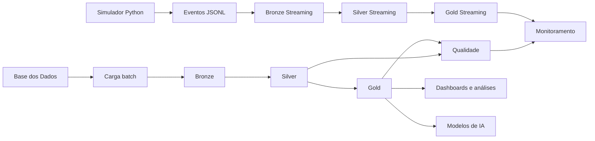

# Arquitetura da solução

## Decisões principais

- BigQuery como data lakehouse analítico;
- Arquitetura Medalhão;
- batch para dados históricos;
- micro-batches para simulação em tempo quase real;
- partição pela data de ingestão;
- clustering por chaves de consulta;
- preservação de valores nulos e divergências entre fontes.
